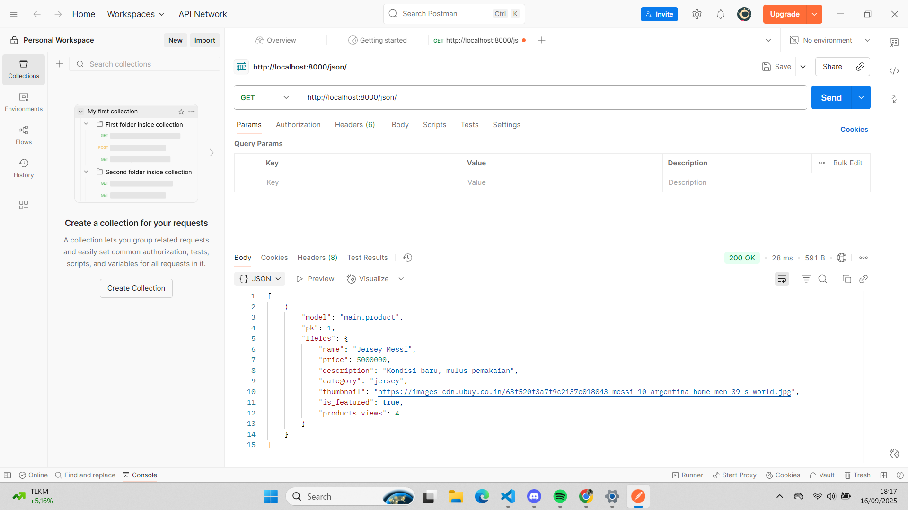
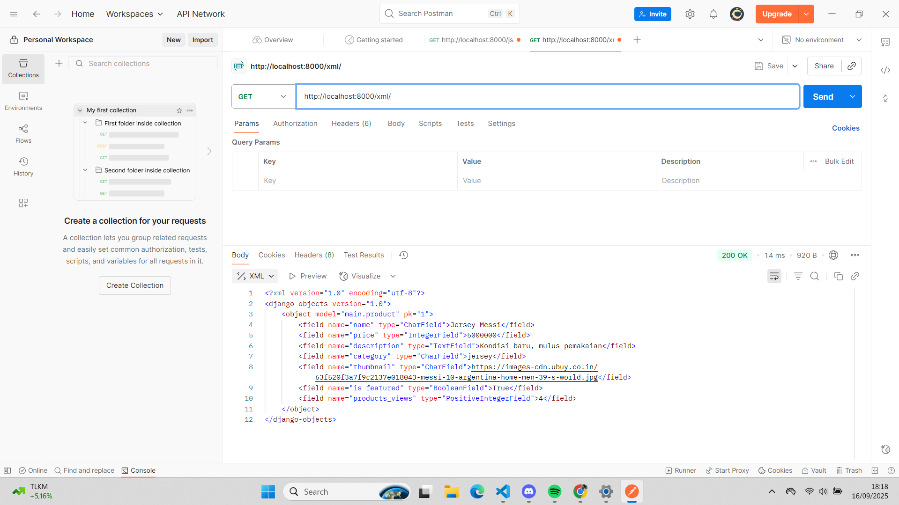
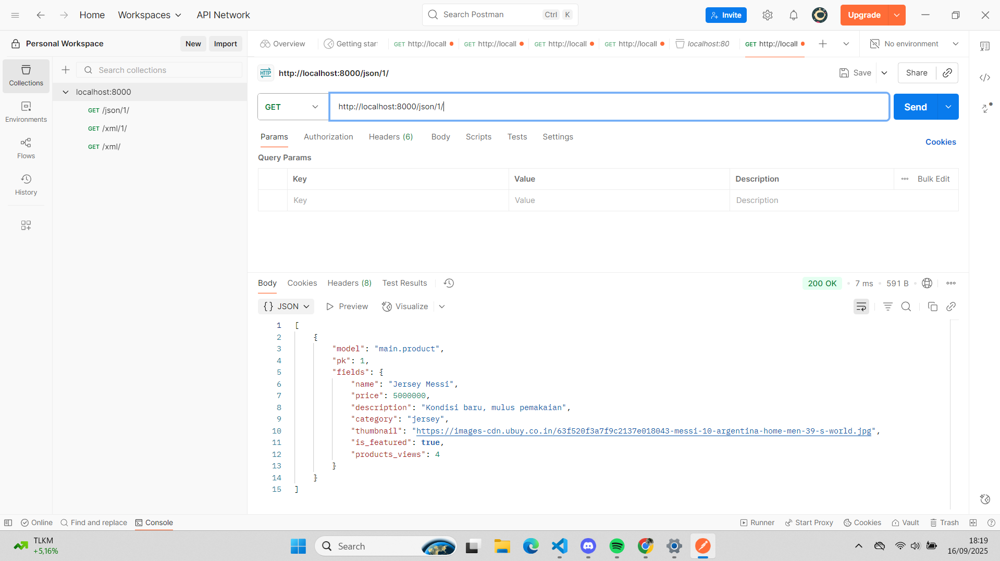
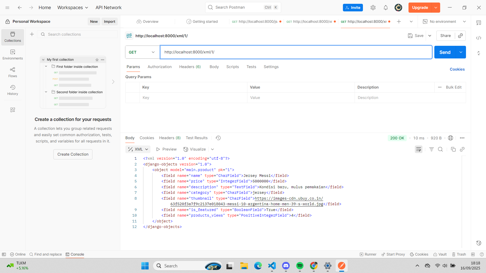
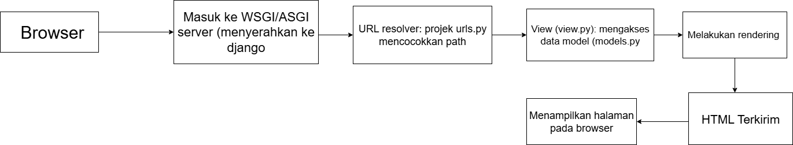

Perbedaan antara ynchronous request dan asynchronous request adalah, ynchronous request merupakan jenis permintaan di mana browser akan menunggu respons dari server sebelum melanjutkan proses lainnya. Artinya, halaman akan berhenti sementara hingga server mengirimkan respons. Sedangkan, asynchronous request adalah permintaan yang berjalan di latar belakang tanpa perlu menghentikan aktivitas di halaman utama. Dengan asynchronous request (seperti pada AJAX), pengguna tetap bisa berinteraksi dengan halaman meskipun data sedang dikirim atau diterima dari server.

2. Cara AJAx bekerja di django dengan cara, mengirimkan data ke server secara asinkron menggunakan JavaScript.
Alur nya seperti:
- Saat terjadi event (misalnya klik tombol atau submit form), JavaScript akan mengirim HTTP request ke URL Django melalui fetch() atau XMLHttpRequest().
- Request ini diproses oleh view Django, yang kemudian mengambil data dari database atau melakukan logika tertentu.
- View Django akan mengembalikan JsonResponse atau sebagian HTML sebagai respons
- Setelah menerima respons, JavaScript akan memperbarui tampilan halaman (DOM) sesuai data yang diterima tanpa memuat ulang halaman secara keseluruhan.

3. Keuntungan menggunakan AJAX dibandingkan render biasa di Django adalah membuat interaksi pengguna menjadi lebih cepat dan dinamis. Dengan AJAX, halaman tidak perlu di-refresh setiap kali melakukan permintaan ke server, sehingga Waktu respon menjadi lebih singkat, Penggunaan bandwidth lebih efisien, Proses seperti pencarian data, validasi form, dan update konten bisa dilakukan secara real-time.

4. Cara memastikan keamanan saat menggunakan AJAX untuk fitur Login dan Register di Django adlah dengan menerapkan beberapa hal berikut: 
- Gunakan CSRF Token untuk setiap permintaan POST agar server dapat memverifikasi keaslian permintaan.
- Gunakan HTTPS agar data sensitif seperti password tidak bocor.
- Lakukan validasi di sisi server agar input tidak bisa dimanipulasi dari sisi klien.
- Lindungi dari serangan XSS dengan cara melakukan escaping pada data yang akan ditampilkan di halaman.
- Batasi percobaan login untuk mencegah serangan brute force.

5. Pengaruh AJAX terhadap pengalaman pengguna (User Experience) pada website adalah AJAX memberikan pengaruh yang besar terhadap peningkatan User Experience (UX). Dengan AJAX, interaksi di website menjadi lebih cepat, responsif, dan terasa mulus. Pengguna tidak perlu menunggu reload halaman setiap kali melakukan aksi seperti menambah data, login, atau mencari informasi.

1. Urutan prioritas pengambilan CSS selector adalah jadi, CSS memiliki urutan atau prioritas yang menentukan aturan mana yang akan mereka terapkan pada elemen HTML seperti:
- universal selector: Universal selector ini memiliki prioritas yang paling rendah
- Type selector: memiliki prioritas yang lebih tinggi dari universal selector
- Class selector: Class selector ini memilih elemen berdasarkan kelas yang ditentukan
- ID selector: Memilih elemen berdasarkan ID yang ditentukan 
- Inline styles: Inline styles merupakan aturan CSS yang ditulis langsung dalam html menggunakan atribut style dan inline style memiliki prioritas tertinggi 

2. Responsive design menjadi konsep yang penting dalam pengembangan aplikasi web karena responsive design ini dapat membuat website kita terlihat sangat baik di berbagai perangkat yang kita gunakan seperti laptop, tablet, atau handphone. Responsive web ini dapat meemastikan bahwa user tidak terganggu akan format web yang berubah-ubah, jadi tampilan web akan menyesuaikan ukuran layar dari perangkat yang kita gunakan. Sudah banyak aplikasi atau web yang menerapkan Responsive design ini, contohnya Facebook. Aplikasi ini dapat menyesuaikan elemen-elemen dengan ukuran layar yang berbeda.

3. Perbedaan antara margin, border, dan padding adalah Margin merupakan sebuah ruang di luar elemen dan biasanya digunakan untuk memberikan jaarak atau space pada antar elemen web, berbeda dengan border yang merupakan sebuah garis mengelilingi elemen. Biasanya, border digunakan untuk memberikan batas-batas visual pada elemen. Sedangkan padding adalah ruang dalam elemen, yang memberikan ruang ekstra agar konten yang kita buat tidak terlalu menepi. Berikut adalah contoh implementasi margin, border, padding:
Margin: margin: 30px;
Border: border: 2px solid black;
Padding: padding: 15px;

4. Konsep flexbox atau flexible box layout adalah metode dimana tata letak suatu dimensi yang memungkinkan elemen disusun dalam suatu baris atau kolom. Flexbox juga biasa digunakan untuk mengatur ruang di antara elemen secara responsif dan dinamis. Biasanya flexbox berguna untuk pengaturan elemen dalam suatu baris atau kolom yang flexible dan responsif. Sedangkan Grid layout adalah metode tata letak dua dimensi yang memungkinkan elemen dapat disusun dalam baris atau kolom. Kegunaan dari grid layout adalah untuk tata letak yang lebih kompleks, seperti galeri foto, atau dashboard.

5. Cara saya mengimplementasi checklist-checklist diatas adalah dengan mempelajari ulang tutorial lalu mengikuti dan menyesuaikan dengan tugas pada saat ini. Selain itu, saya juga mempelajari dari sumber yang ada untuk membuat navbar yang sesuai dengan instruksi tugas walaupun masih terjadi beberapa hal yang error.

1. Django AuthenticationForm adalah form bawaan Django yang disediakan pada modul untuk melakukan autentikasi user. Default dari AuthenticationForm pada dasarnya terdiri dari dua field utama yaitu password dan username. Kelebihan dari AuthenticationForm adalah kita tidak perlu menuliskan kode nya dari nol karena sudah bawaan Django. Selain itu, juga sudah terintegrasi dengan sistem auth Django jadi bekerja langsung dengan user model dan session framework. AuthenticationForm pada Django juga mudah diperluas seperti bisa menambahkan field tambahan. Kekurangan dari AuthenticationForm adalah sangat terbatas pada username dan password yang standart, jika user inin login menggunakan kode OTP, Google, dll, maka kita harus mengubah lebih lanjut. Tidak hanya itu, pada era modern bisa dibilang kurang fleksibel, jika menginginkan design UI/UX yang lebih interaktif maka kita harus mengubah lebih lanjut.

2. Perbedaan antara autentikasi dan otorisasi adalah autentikasi lebih mengarah ke "siapa kamu?" sedangkan kalau otorisasi adalah "apa saja akses mu" jadi lebih mengarah hal apa saja yang boleh kita lakukan. Cara Django mengimplementasikan kedua konsep tersebut adalah dengan session/cookie, AuthenticationMiddleware, lalu menggunakan authenticate() mengiterasi AUTHENTICATION_BACKENDS, melanjutkan dengan password hashing terakhir dengan login/logout.

3. Kelebihan dan kekurangan session dan cookies dalam konteks menyimpan state di aplikasi web adalah pada cookie, kelebihannya kita mudah untuk scale karena tanpa state di server, biasa diakses oleh JavaScript, dan implementasi yang simple untuk data kecil. Kekurangannya adalah cookies memiliki batas ukuran yang kecil dan terbawa di setiap request sehingga borros bandwith, untuk menampung data sensitif sangat berisiko. Kalau untuk sessions, kelebihannya adalah lebih aman untuk data-data sensitif, kontrol akses menjadi lebih mudah. Kekurangannya adalah butuh penyimpanan di server, dan sangat rentan untuk dihijack bila tidak divalidasi dengan benar.

4. Penggunaan cookies secara umum tidak otomatis aman secara default, tetapi akan bisa aman jika kita mengonfigurasinya dengan benar dan tidak menyimpan data sensitif klien. Risiko yang ada juga cukup beragam seperti terjadinya pencurian via XSS, mengalami CSSRF, terjadinya session hijacking, sampai kebocoran privasi. Tetapi, Django menyediakan default yang aaman asalkan kita mengaktifkan:Cookie sesi & konfigurasi keamanan, Middleware & header keamanan, Proteksi CSRF bawaan, Mitigasi session fixation/hijacking.

5. Cara saya memulai setiap checklist diatas adalah dengan membaca ulang tutorial 3, lalu mulai coba mengimplementasikan pada tugas saya, Proses cukup mudah cuma ada beberapa kendala pada saat saya lupa melakukan migrasi setiap mengubah models. Tetapi selain dari pada itu sudah aman. Tidak hanya itu, program sudah berjalan dengan baik, sesuai permintaan, tetapi kendala yang sama balik lagi yaitu link tidak bisa dibuka melalui PWS. 

Link aplikasi: 
1. Data delivery dalam implementasi platform merupakan peran yang penting karena platform bisa melakukan pertukaran data antar sistem. Jika tidak ada data delivery, platform tidak dapat mengirim data dan informasi yang dibutuhkan sehingga informasi dan data yang kita butuhkan tidak sampai kepa a kita.

2. Menurut saya pribadi, json lebih baik dari pada xml karena json memiliki struktur yang mudah dibaca dan tampilan sederhana bahkan untuk pemula sekalipun. Sedangkan xml menggunakan tag yang lebih panjang dan lebih kompleks dibandingkan dengan json, Sehingga mesin lebih cepat memroses dan memahami. Selain itu, json juga memiliki ukuran file yang lebih kecil dibandingkan dengan xml jadi dari sisi efisien, json lebih unggul dan disukai banyak orang. Sedangkan xml memiliki ukuran file yang lebih besar sehingga dapat memperlambat proses pengiriman data. Dengan itu, banyak orang yang memilih menggunakan json karena keunggulannya tersebut.

3. Fungsi is_valid() pada pada form Django adalah untuk melakukan pemeriksaan terhadap data yang kita masukkan apakah valid atau tidak dengan yang kita inginkan. Method ini penting dan kita butuhkan karena jika ada data yang tidak cocok dengan kriteria kita, maka hal itu dapat menimbulkan potensi adanya virus atau hal-hal yang tidak kita inginkan.

4. Kita membutuhkan csrf_token saat membuat form di Django karena csrf_token dapat kita gunakan untuk mencegah CSRF atau Cross-Site Request Forgery yang dimana ini merupakan serangan yang menggunakan otentikasi user untuk mengirim permintaan yang tidak resmi. Serangan ini dapat membahayakan situs kita maupun situs lain.

5. Cara saya implementasi setiap check list diatas dimulai dengan me-review ulang dari  tutorial 2 dan memahami kembali. Pada saat pengerjaan terdapat kendala yaitu auto save pada vscode saya tidak aktif yang mengakibatkan kode-kode saya tidak ter-update sehingga kode saya tidak muncul di local host. Karena mengikuti tutorial 2, banyak penamaan variabel bahkan function yang salah (harusnya products menjadi news). Untungnya asdos sangat membantu dengan fast respon.

6. Asdos sudah bekerja dengan baik

7. 
    
    
    

Link aplikasi: https://theo-samuel-toko-football.pbp.cs.ui.ac.id/
1. Cara saya implementasi setiap checklist diatas, yang pertama adalah dengan membuat framework seperti: membuat folder baru, mengaktifkan environtment (python -m venv env), serta melakukan instalasi depedensi awal. Langkah kedua adalah dengan membuat struktur ptojek dengan cara menaruh file settings, manage.py, dan lain-lain di root django-admin start ptoject. Setelah itu, kita mendefinisikan model (membuat file models.py) yang berisi atribute yang akan kita gunakan aplikasi seperti nama, harga, deskirpsi, thumbnail, kategori, dan is_featured, lalu diikuti dengan tipe data masing-masing. Lalu, kita bisa membuat dan menjalankan migrasi. Jangan lupa untuk kita melakukan routing URL agar link yang kita buat bisa diakses oleh orang lain dan django akan mencocokkan URL dengan pola yang ada di file urls.py. Langkah selanjutnya kita bisa memulai untuk membuat isi dari aplikasi kita dengan html. Langkah terakhir, jangan lupa push ke Github dan PWS. 

2. 
Kaitan antara urls.py, views.py, models.py, dan berkas html adalah urls.py merupakan file yang membuat arah URL ke file view.py sedangkan, views.py adalah logika request yang berfungsi mengambil atau mengubah data melalui models.py berbeda dengan models.py, models.py sendiri merupakan definisi struktur dan query data. Sedangkan, html sendiri adalah file tampilan yang diproses oleh view.py menggunakan cariable dari context.

3. Peran settings pada proyek django adalah sebagai panel kontrol atau pusat konfigurasi pada seluruh projek django. Django memuatnya pada saat start melalui variable environment DJANGO_SETTINGS_MODULE.

SECRET_KEY = os.environ.get("SECRET_KEY")  # simpan di env, JANGAN commit
DEBUG = os.environ.get("DEBUG", "0") == "1"
ALLOWED_HOSTS = ["localhost", "127.0.0.1", "example.com"]

kode di atas merupakan contoh mengapa settings.py ppenting pada projek django. Pada bagian SECRET_KEY, lalu dilanjutkan pada DEBUG yang berisi True pada lokal dan di produksi wajib bernilai FALSE. Selanjutnya ada ALLOWED_HOSTS yang berisi daftar domain yang diizinkan melayani request.

4. Cara kerja migrasi pada database django dimulai dengan mengubah model terlebih dahulu di model.py. Setelah itu kita bisa menjalankan python manage.py makemigrations yang berfungsi untuk menciptakan file yang dimana isinya merupakan perubahan model yang belum teraplikasi ke dalam basis data. Lalu kita jalankan python manage.py migrate untuk migrasi yang berfungsi untuk mengaplikasi perubahan model yang ada dalam file ke basis data. Setiap kita perubahan pada model, kita wajib melakukan migrasi untuk merefleksikan perubahan tersebut. Setelah itu django akan menyimpan perubahan yang sudah diterapkan.

5. Django dijadikan permulaan untuk pembelajaran pengembangan perangkat lunak karena django sudah terdapat template bawaan seperti: routing, template engine, ORM, form dan validasi, dan masih banyak lagi sehingga memudahkan kita untuk belajar. Tidak hanya itu, dokumentasi dan ekosistem yang django miliki sudah bagus. Dokumentasi jelas dan banyak komunitas yang menyediakan berbagai tutorial sehingga belajar menjadi lebih mudah karena akses sudah ada dimana-mana. Selain itu django sudah berbasis python yang memudahkan untuk dibaca.

6. Sejauh ini asisten dosen sudah melakukan tugas dengan baik dan ketika saya mengalami kesulitas, asdos menjelaskan dengan senang hati sampai saya bisa mengerjakannya
